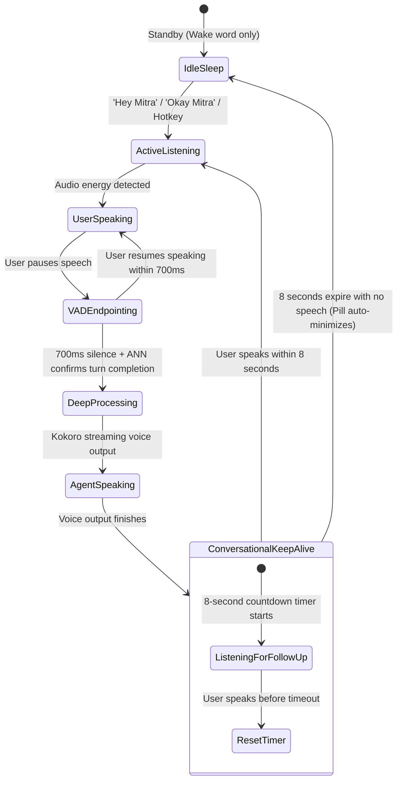
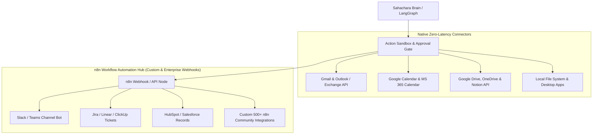
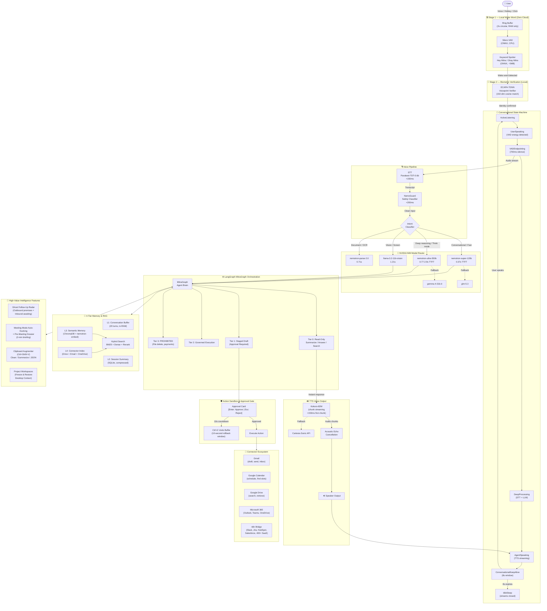
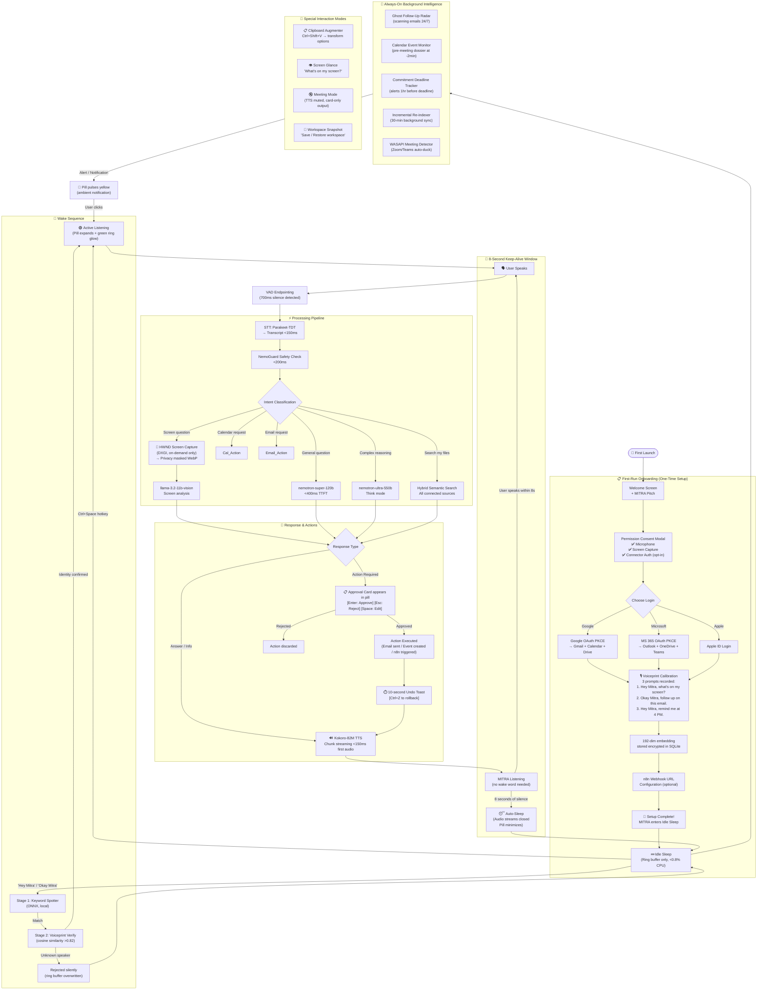
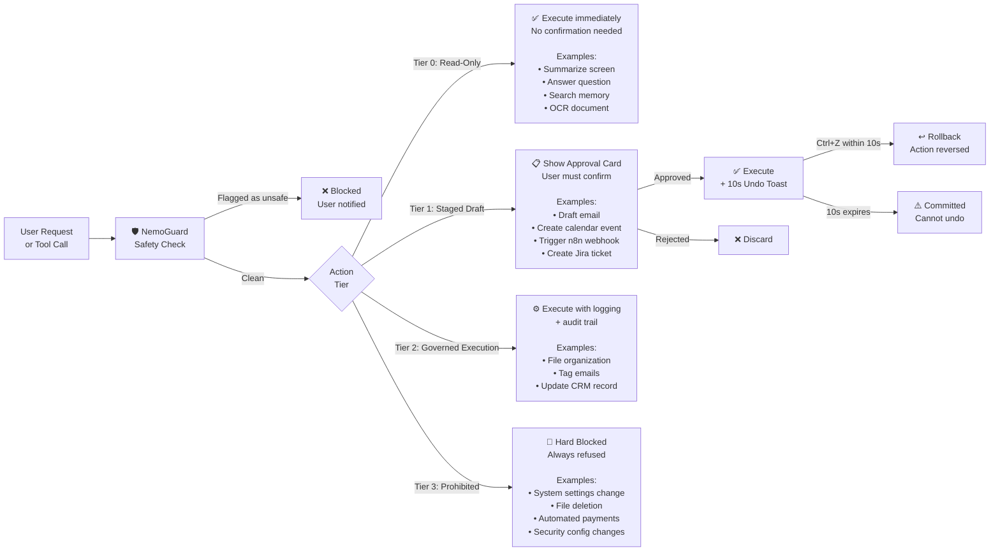
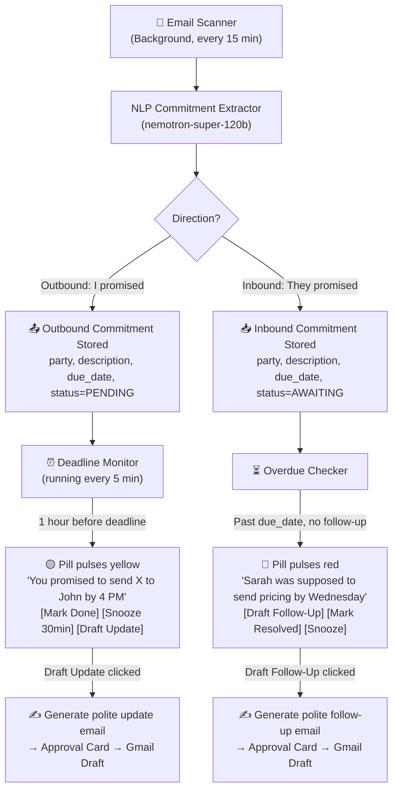

# PROJECT SAHACHARA: PRODUCTION ARCHITECTURE & MASTER BLUEPRINT
**Version:** 4.0.0-PROD  
**Assistant Official Name:** **MITRA** (*"The Trusted Companion & Guardian"*)  
**Wake Phrases:** *"Hey Mitra"* / *"Okay Mitra"*  
**Target:** Enterprise & Corporate Multi-Persona Productivity Companion  
**Form Factor:** Native Desktop (Tauri v2 + Rust) with Ambient Floating Pill / Tray UI & High-Performance Cloud Backend

---

## 1. THE HACKATHON PITCH & THE PROBLEM GAP

> *"On mobile, Google Gemini and Siri live seamlessly with you—waking on voice, seeing what is on your screen, and assisting you effortlessly. But on desktop personal computers—where 90% of high-value professional work, architectural modeling, video editing, corporate negotiations, and document drafting actually happens—AI is still trapped in a browser tab or a bulky chat window.*
>
> *Project Sahachara bridges this gap with **MITRA**. It is the first ambient, voice-biometric-activated, vision-aware AI companion built natively for PC professionals. It wakes up on your unique voice using a private 2-stage acoustic detector, docks elegantly like a Dynamic Island, glances at active software on-demand, tracks all commitments and deadlines autonomously, searches company drives semantically, and executes actions safely via native connectors and n8n orchestration."*

---

## 2. CLIENT-SIDE ARCHITECTURE (DESKTOP INTERFACE)

### 2.1 Technology Stack & Resource Budget
* **Shell Framework:** Tauri v2 (Rust core + Webview frontend).
* **Binary Size & Memory Footprint:** < 35 MB installer, **35–50 MB idle RAM** (90% lighter than Electron apps like Slack/Teams which consume 400MB+).
* **CPU Usage:** < 0.8% at idle (VAD running in low-power sleep mode).
* **Frontend:** React 19 / Svelte 5 + TypeScript + Tailwind CSS (Glassmorphism, animated soundwaves, Dynamic Island morphing).

### 2.2 First-Run Privacy Onboarding & Permission Handshake
Before capturing a single frame or audio sample, the application presents a transparent **System Permission Consent Modal**:
1. **Microphone Access:** Explicit OS privacy prompt + explanation of local-only wake-word buffering.
2. **Screen Recording / Capture:** OS Graphics Capture consent with clear declaration of on-demand shutter triggers (no background passive recording).
3. **Connectors Authorization (OAuth):** Opt-in permissions for Google Workspace, MS 365, or n8n webhooks.
4. **Visual Mic/Screen Indicator:** Whenever the microphone is streaming or screen is captured, the floating pill displays a glowing green privacy ring with active indicator badges.

### 2.3 Personalized Voiceprint Biometrics (Option B Architecture)
To ensure only **your** voice can trigger Mitra on your PC:
* **3-Prompt Onboarding Calibration:**
  * *"Say: 'Hey Mitra, what's on my screen?'"*
  * *"Say: 'Okay Mitra, follow up on this email.'"*
  * *"Say: 'Hey Mitra, remind me at 4 PM.'"*
* **Local Embedding Vector Extraction:**
  * Uses a compact local acoustic ONNX model (Resemblyzer / ECAPA-TDNN, ~15MB) running on CPU via `ort`.
  * Extracts a 192-dimensional voiceprint vector stored strictly in local encrypted SQLite.
* **Rolling Acoustic Adaptation:**
  * When you switch microphones (e.g. laptop mic to AirPods) or have morning voice, successful confirmed interactions smoothly update your rolling voice print vector so you are never locked out.
  * Colleague / stranger speech is rejected automatically via cosine thresholding.

### 2.4 Apple / Gemini Two-Stage Wake Word Architecture
To ensure 100% privacy, near-zero CPU usage, and zero false-cloud streaming:
1. **Stage 1 (Local Ultra-Low Power Micro-Head):** Runs locally on CPU via ONNX (`ort` crate). Operates on an ephemeral 2-second circular audio buffer in RAM. If sound level or phoneme signature doesn't match *"Hey Mitra"* or *"Okay Mitra"*, audio is instantly overwritten in RAM. **Zero bytes ever leave the PC**.
2. **Stage 2 (Local Acoustic Verifier + Voice Biometrics):** A 50ms verification pass verifies the wake word and confirms the voice embedding matches your registered profile.
3. **Stage 3 (Cloud Wake Handshake):** Only after Stage 2 fires does Mitra light up the floating pill with a visual ring and open the streaming WebSocket to the cloud backend.

### 2.5 Intelligent Conversational State Machine (8-Second Keep-Alive Window)

1. **Dynamic Speech Endpointing (VAD + ANN):** 700ms silence + turn-completion classification triggers reply without push-to-talk.
2. **8-Second Follow-up Keep-Alive:** Assistant remains listening for 8 seconds after speaking. Natural continuous multi-turn dialogue without repeating the wake word.
3. **Graceful Auto-Sleep:** Shuts down audio streams after 8 seconds of silence to conserve battery and cloud tokens.

### 2.6 Screen Capture Engine & Hardware Handling
* **Technology:** Windows Graphics Capture API / DirectX Desktop Duplication (`IDXGIOutputDuplication` via `windows-rs`).
* **HWND-Targeted Window Capture:** Targets specific active application handles (HWND) to eliminate DPI blur and coordinate displacement across multi-monitor 4K / high-DPI setups (125%, 150%, 200%).
* **Zero-Obstruction Auto-Docking:** Snaps into a 3px translucent border on the screen edge when working in full-screen creative software (Premiere, AutoCAD), expanding instantly when called.
* **Client-Side Privacy Filter:** Local heuristic/regex canvas masking for sensitive fields (credit cards, passwords, SSNs) before compression to WebP.

---

## 3. PROFESSIONAL AUTHENTICATION & LOGIN FLOW

* **Architecture:** OAuth 2.0 with PKCE via System Default Browser + Custom Deep Link (`sahachara://auth/callback`).
* **Supported Providers:**
  1. **Google Workspace (1-Click Gmail/Google Account)**
  2. **Microsoft 365 (Corporate Azure AD / Entra ID for corporate SSO)**
  3. **Apple ID (Sign in with Apple)**
* **Secure Token Vault:** Tokens are encrypted in the OS-native **Windows Credential Locker** using the Rust `keyring` crate. Zero plaintext credentials on disk.

---

## 4. NVIDIA NIM PRODUCTION MODEL MAPPING (PRIMARY + FALLBACK MATRIX)

Based on empirical live benchmarking against the NVIDIA integrate gateway, the system implements a resilient **Multi-Tier Primary & Fallback Routing Matrix**:

| Role in MITRA | Primary Model (Fast & Live) | Latency | Fallback Model | Rationale & Strengths |
| :--- | :--- | :---: | :--- | :--- |
| **Fast Brain & Voice Router** ⚡ | **`nvidia/nemotron-3-super-120b-a12b`** | **0.37s** | **`z-ai/glm-5.3`** (1.00s) | 120B MoE (12B active). Sub-400ms TTFT! Ultra-fast, ideal for live conversational speech. |
| **Deep Reasoning & LangGraph Brain** 🧠 | **`nvidia/nemotron-3-ultra-550b-a55b`** | **0.77s - 2.9s** | **`google/gemma-4-31b-it`** (11.4s) | 550B MoE (55B active). 1M context hybrid Mamba-Transformer. Frontier reasoning & tool-calling. |
| **Screen Glance & App Vision** 👁️ | **`meta/llama-3.2-11b-vision-instruct`** | **1.21s** | **`meta/muse-glimmer-30b`** (2.06s) | Real-time visual UI layout recognition, Premiere/CAD screen comprehension. |
| **Document, Table & Clause OCR** 📄 | **`nvidia/nemotron-parse-2.0`** | **0.71s** | **`meta/llama-3.2-11b-vision-instruct`** | Fine-tuned for dense tables, complex PDFs, and contract legal clause parsing. |
| **Semantic Search Embeddings** 🔍 | **`nvidia/nemotron-3-embed-1b`** | **0.55s** | **Local `BGE-M3` (ONNX)** | 2048-dim vector embeddings for hybrid cross-app search (Drive + Email + Disk). |
| **Real-Time Speech Recognition (STT)** 🎙️ | **`nvidia/parakeet-tdt-0.6b-v2`** | **< 150ms** | **Local Whisper / Deepgram Nova-3** | Ultra-low latency English ASR with built-in word timestamps and capitalization. |
| **Content Safety & Anti-Injection Guard** 🛡️ | **`nvidia/llama-3.1-nemoguard-8b-content-safety`** | **< 200ms** | **Local Regex / ANN Classifier Head** | Guards against indirect prompt injection from untrusted web pages and malicious documents. |

---

## 5. INTEGRATION ECOSYSTEM & CONNECTORS (N8N + NATIVE APIS)

### 5.1 Native Direct Connectors
* **Google Workspace:** Gmail (inbox scan, draft replies), Google Calendar (auto-scheduling), Google Drive (instant document retrieval).
* **Microsoft 365:** Outlook, MS Teams, OneDrive, SharePoint (via Microsoft Graph API for corporate enterprise users).
* **Notion & Slack:** Direct bridges for team channels and company wikis.

### 5.2 The n8n Workflow Supercharger
* Mitra acts as the **Intelligent Brain**, while **n8n acts as the Multi-System Muscle**.
* Structured JSON payloads sent to n8n webhooks trigger deterministic multi-step actions across 400+ SaaS apps (Jira, Salesforce, Slack, QuickBooks) with automatic retry and error reporting.

---

## 6. COGNITIVE ARCHITECTURE & ADVANCED INTELLIGENCE FEATURES

### 6.1 The "Ghost Follow-Up" Radar (Two-Way Commitment Engine)
1. **Outbound Promises ("I Owe You"):** Detects promises made in emails/Slack (*"I'll send the quote by 4 PM"*) and proactively alerts you 1 hour before.
2. **Inbound Awaiting ("You Owe Me"):** Tracks deliverables promised by others (*"Will send pricing by Wednesday"*) and prompts a 1-click polite follow-up draft if they miss it.

### 6.2 Meeting-Mode Auto-Ducking & Pre-Meeting Dossier
* **Meeting-Mode Auto-Ducking:** Automatically monitors Windows Audio Sessions. If Zoom, Teams, or Google Meet is active, Mitra **never speaks out loud**, automatically switching to silent on-screen floating cards.
* **Pre-Meeting 2-Minute Dossier:** Pulses 2 minutes before Google/Outlook calendar calls with a 3-bullet dossier (attendees, previous decisions, today's objective).

### 6.3 Universal Intelligent Clipboard Augmenter (`Ctrl + Shift + V`)
* Copying messy unstructured text triggers an instant badge to paste **auto-cleaned, formatted into a clean markdown table, summarized into bullets, or converted into structured JSON**.

### 6.4 The 10-Second Undo Action Buffer (`Ctrl + Z`)
* Every executed action (email draft, calendar invite, Jira ticket) shows a 10-second countdown toast: `[Undo Action (Ctrl + Z)]`. Pressing it triggers a zero-consequence rollback.

### 6.5 Contextual "Project Workspaces" Snapshots
* Freeze and restore full desktop mental context (open software, reference files, pending checklists) under project tags (e.g., *"Save Workspace: Q3 Architecture Review"*).

---

## 7. STREAMING VOICE ENGINE (KOKORO-82M)

* **Speech-to-Text (STT):** NVIDIA Parakeet-TDT 0.6b v2 or Deepgram Nova-3 (< 150ms).
* **Fast LLM:** DeepSeek-v4.1-Flash NIM (< 150ms TTFT).
* **Streaming Voice (TTS): Kokoro-82M Engine:**
  * Self-hosted on low-cost cloud GPU / CPU via `kokoro-fastapi` or ONNX.
  * **Chunk-based streaming:** Synthesizes and transmits audio buffers as soon as 4–6 words are generated by the LLM. Total voice round-trip latency < 400ms.
  * Acoustic Echo Cancellation (AEC) & Software Ducking: Automatically ducks microphone input during TTS playback unless speech barge-in is detected.
  * Fallback option: Cartesia Sonic API for managed zero-infra sub-100ms TTS.

---

## 8. ACTION SANDBOX & AUTONOMY GOVERNANCE

* **Tier 0 (Read-Only Ambient):** Screen OCR, document summarization, answering questions. No confirmation needed.
* **Tier 1 (Staged Draft / 1-Click Approval):** Drafting emails, scheduling meetings, triggering n8n flows. Actionable card in the floating pill: `[Enter: Approve | Esc: Reject | Space: Edit]`.
* **Tier 2 (Governed Execution):** Routine file organization and ticket generation.
* **Tier 3 (Prohibited):** System settings modification, file deletion, automated payment transmission.
* **Indirect Prompt Injection Defense:** All screen/document OCR text is wrapped in `<untrusted_visual_payload>` tags.

---

## 9. IMPLEMENTATION ROADMAP

See **[IMPLEMENTATION_PLAN.md](./IMPLEMENTATION_PLAN.md)** for the full 7-phase execution plan with detailed tasks, acceptance criteria, and rigorous testing gates at each phase boundary.

**Phase summary:**
* **Phase 1** — Foundation Shell, Wake-Word Engine, Voiceprint Biometrics *(local/offline only)*
* **Phase 2** — Cloud Brain: FastAPI + NVIDIA NIM + LangGraph + RAG Memory
* **Phase 3** — Authentication (OAuth PKCE) + HWND Screen Capture Engine
* **Phase 4** — Full Voice Pipeline: STT → LLM → Kokoro TTS (<400ms E2E)
* **Phase 5** — Connectors (Google/MS365/n8n), Ghost Radar, Meeting Guard, Clipboard Augmenter, Undo Buffer
* **Phase 6** — Frontend UI Polish: Glassmorphic Floating Pill, Dynamic Island, Onboarding *(frontend is deliberately LAST)*
* **Phase 7** — Packaging, Code Signing, Auto-Updater, Final E2E Regression

---

## 10. SYSTEM FLOWCHARTS

### 10.1 Complete Feature Architecture Flowchart

---

### 10.2 User Interaction Flow — From First Boot to Active Use

---

### 10.3 Action Safety Tier Flowchart

---

### 10.4 Ghost Follow-Up Radar Flow

